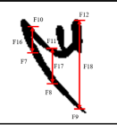

# Handwritten Digits Classification based on Novel Structural Features using Machine Learning

Structural features were extracted using OpenCV.
Features were fed to various machine learning models; highest accuracy yielded was 98.10%

### Initial Dataset

### Sample Structural Feature Extraction

